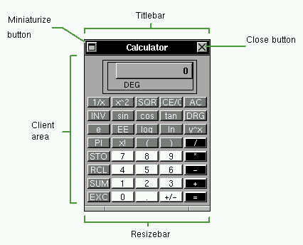
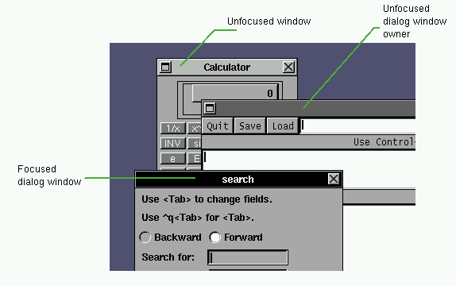
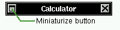
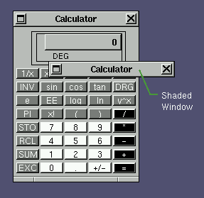
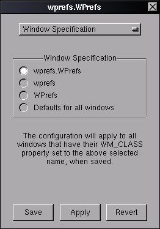
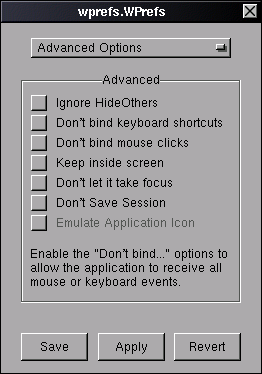
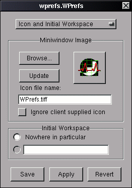
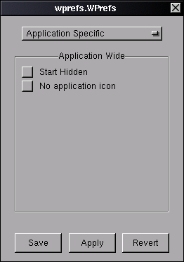

Windows
=======

Anatomy of a Window
-------------------

Generally an application will have the following layout:

Titlebar
   The titlebar presents the name of the application, document or window. It's
   color indicates the keyboard focus state and type of the window. You can use
   it to move, activate, raise, lower and access the window commands menu.

Miniaturize button
   You can click on the miniaturize button to miniaturize/iconify a window or
   click it with the **Meta** key pressed to hide the application.

Close Button
   The close button can be used to close a window or kill the application, if
   the application can't understand the close message.

Resizebar
   You use the resizebar to (surprise!) resize a window.

Client Area
   The client area is where the application show it's information. If the
   window if inactive, you can click on it to activate it.

Working With Windows
--------------------

Focusing a Window
~~~~~~~~~~~~~~~~~

Windows can be in two states: *focused*, or *unfocused.* The focused window
(also called the key or active window) has a black titlebar and is the window
that receives keyboard input, ie: where you can type text. Usually it's the
window where you work on. Only one window may be focused at a time. Unfocused
windows have a light gray titlebar. Some applications have a special type of
window, called dialog windows transient windows or panels. When these windows
are active, the window that owns them (the main window) get a dark gray
titlebar. As soon as the dialog window is closed, the focus is returned to the
owner window.

The image below shows an active Open File panel and it's owner window.

There are three styles of window focusing:

**Click-to-Focus**, or manual focus mode. In click-to-focus mode, you
explicitly choose the window that should be focused. This is the default mode.

**Focus-Follow-Mouse**, or auto-focus mode. In this mode, the focused window is
chosen based on the position of the mouse pointer. The window below the mouse
pointer is always the focused window.

**Sloppy-Focus**, or semi-auto-focus mode. This is similar to the
focus-follow-mouse mode, but if you move the pointer from a window to the root
window, the window will not loose focus.

You can choose between these modes with the *FocusMode* option.

To focus a window in **Click-To-Focus** mode:

- Click on the titlebar, resizebar or in the client area of the window with the
  left or right mouse button.

OR

- Click on the titlebar with the middle mouse button. This will focus the
  window without bringing it to the front.

OR

- Open the window list menu and select the window to focus.

When you click in the client area of an inactive window to set the focus, the
click is normally processed by the application. If you find this behaviour a
little confusing, you can make the application ignore this click by using the
*IgnoreFocusClick* option.

To focus a window in **Focus-Follow-Mouse** mode:

- Move the pointer over the window you want to focus.

Reordering Overlapping Windows
~~~~~~~~~~~~~~~~~~~~~~~~~~~~~~

Windows can overlap other windows, making some windows be over or in front of
others.

To bring a window to the front:

- Click on the titlebar or resizebar of the desired window with the left mouse
  button.

OR

- Select the desired window from the Window List menu.

Dialog/transient windows are always placed over their owner windows, unless the
*OnTopTransients* option is disabled. Some windows have a special attribute
that allow them be permanently over normal windows. You can make specific
windows have this attribute use the *AlwaysOnTop* window option or set it in
the Window Inspector panel.

**Extra Bindings**

+------------------------------------+--------------------------------------+
| Action                             | Effect                               |
+====================================+======================================+
| Meta-Click on the window titlebar, | Sends the window to the              |
| with the left mouse button         | back.                                |
+------------------------------------+--------------------------------------+
| Meta-Click on the Client Area of   | Brings the window to the front and   |
| the window with the left mouse     | focuses it.                          |
| button.                            |                                      |
+------------------------------------+--------------------------------------+
| Hold the Meta key and press the Up | Brings the current focused window to |
| Arrow key                          | the front.                           |
+------------------------------------+--------------------------------------+
| Hold the Meta key and press the    | Sends the current focused window to  |
| Down Arrow key                     | the back.                            |
+------------------------------------+--------------------------------------+

Moving a Window
~~~~~~~~~~~~~~~

To move the window around the screen, drag the window through it's titlebar
with the left mouse button pressed. This will also bring the window to the
front and focus the window.

To move a window:

- Click on the titlebar of the window you want to move with the left mouse
  button and drag it with the button pressed.

While you move the window, a little box will appear in the screen, indicating
the current window position in pixels, relative to the top left corner of the
screen. You can change the location of this position box by hitting the Shift
key during the move operation.

In some rare occasions, it is possible for a window to be placed off screen.
This can happen with some buggy applications. To bring a window back to the
visible screen area, select the window in the Window List menu. You can prevent
windows from doing that with the *DontMoveOff* window attribute.

**Extra Bindings**

+-------------------------------------+---------------------------------------+
| Action                              | Effect                                |
+=====================================+=======================================+
| Drag the titlebar with the middle   | Move the window without changing it's |
| mouse button                        | stacking order.                       |
+-------------------------------------+---------------------------------------+
| Drag the titlebar while holding the | Move the window without focusing it.  |
| Control key                         |                                       |
+-------------------------------------+---------------------------------------+
| Drag the client area or resizebar   | Move the window.                      |
| while holding the Meta key          |                                       |
+-------------------------------------+---------------------------------------+

Resizing a Window
~~~~~~~~~~~~~~~~~

The size of a window can be adjusted by dragging the resizebar.

Depending on the place you click to drag the resizebar, the resize operation is
constrained to a direction.

To resize a window:

- To change the window's height, click in the middle region of the resizebar
  and drag it vertically.
- To change the window's width, click in either end regions of the resizebar
  and drag it horizontally.
- To change both height and width at the same time, click in either end regions
  of the resizebar and drag it diagonally.

**Extra Bindings**

+------------------------------------+------------------------------------+
| Action                             | Effect                             |
+====================================+====================================+
| Drag the window in the client area | Resizes the window.                |
| with the Right mouse button, while |                                    |
| holding the Meta key               |                                    |
+------------------------------------+------------------------------------+
| Drag the resizebar with the middle | Resize the window without bringing |
| mouse button                       | it to the front                    |
+------------------------------------+------------------------------------+
| Drag the resizebar while holding   | Resize the window without focusing |
| the Control key                    | it.                                |
+------------------------------------+------------------------------------+

Miniaturizing a Window
~~~~~~~~~~~~~~~~~~~~~~

If you want to temporarily get rid of a window, you can miniaturize it.

When miniaturizing a window, it will shrink into a miniwindow with a icon and a
title that is placed at the bottom of the screen.

   A mini-window

You can move the miniwindow around the screen by dragging it. Unlike
application icons, miniwindows cannot be docked.

To restore a window from it's miniwindow, double click the miniwindow. The
window will be restored in the current workspace, with the same position, size
and contents as it had before miniaturization.

To miniaturize a window:

- Click on the miniaturize button

OR

- Use the keyboard shortcut assigned to this action, Meta+m in the default
  configuration.

You can also restore all miniaturized and hidden windows of a given application
by double clicking in it's application icon with the middle mouse button.

Shading a Window
~~~~~~~~~~~~~~~~

If you want to temporarily get rid of a window, an option for it's
miniaturization is to *shade* it. When you shade a window, the window rolls up
to it's titlebar. You can do almost everything you do with a normal window with
shaded windows, like miniaturizing or closing it.

To shade a window:

- Double Click on the titlebar of the window.

Closing a Window
~~~~~~~~~~~~~~~~~

After finishing work in a window, you can close it to completely get rid of it.
When you close a window, it is removed from the screen and can no longer be
restored. So, before closing a window, be sure you have saved any work you were
doing on it.

.. figure:: guide/images/imagtitle2.gif
   :figclass: borderless
   :alt: A Titlebar with a close button

Some windows will have a close button with some dots around it. These windows
can't be closed normally and the only way to get rid of them is by exiting the
application. You should try exiting from inside the application (through it's
menus or buttons) when possible. Otherwise you can force WindowMaker to
``kill`` the application.

To force the closure of a window (by killing the application):

- Hold the Control key and click on the close button.

OR

- Double click the close button.

It is also possible to kill applications that can be normally closed by
clicking the close button while holding the Control key.

Maximizing a Window
~~~~~~~~~~~~~~~~~~~

If you want to resize a window to occupy the whole screen, you can maximize the
window. When you unmaximize it, the window will be restored to the same
position and size it was before maximized.

To maximize a window:

- Hold the Control key and double click on the window titlebar to resize the
  window's height to full screen.

OR

- Hold the Shift key and double click on the window titlebar to resize the
  window's width to full screen.

OR

- Hold both the Control and Shift keys and double click on the window titlebar
  to resize both window's height and width to full screen.

To restore the size of a maximized window:

- Hold the Control OR Shift key and double click on the window titlebar.

You can select whether the window should be maximized to the whole screen or if
the position of the Dock should be accounted for by setting the *WinDock*
option.

The Window Commands Menu
~~~~~~~~~~~~~~~~~~~~~~~~

Clicking on the titlebar of a window with the right mouse button will open a
menu containing commands that will apply to that window. The menu can also be
opened through the keyboard with the Control+Escape key, by default.

(Un)Maximize
   Will either maximize the window horizontally and vertically, or, if the
   window is already maximized, restore the window to the size it was prior to
   being maximized.

Miniaturize
   Will miniaturize the window.

(Un)Shade
   Will shade the window, or unshade it if it is already shaded.

Hide
   Will hide all the windows of the application

Hide Others
   Will hide all current applications except the current one

Move To
   Allows you to move the window to a different workspace

Attributes...
   Opens the Window Attributes Inspector (see section `2.3 <#2.3>`)

Close
   Will close the window

Kill
   Will kill the application. Use this option only if the application does not
   provide means to close it normally, or in extreme cases.

The Window Attributes Inspector
-------------------------------

Window Specification
~~~~~~~~~~~~~~~~~~~~

This panel Allows you to specify the WM_CLASS that WindowMaker should use to
identify the window whose attributes you are setting.

Window Attributes
~~~~~~~~~~~~~~~~~~

This panel lets you set the attributes for the selected window.

.. figure:: guide/images/wiaattrib.gif
   :figclass: borderless
   :alt: Window Attributes Inspector: Window Attributes

Disable titlebar
   Causes the titlebar for the selected window not to be displayed

Disable resizebar
   Causes the resizebar for the selected window not to be displayed

Disable close button
   Causes the close button for the selected window not to be displayed

Disable miniaturize button
   Causes the miniaturize button for the selected window not to be displayed

Keep on Top
   Causes the selected window to stay on top of all other windows

Omnipresent
   Causes the selected window to be displayed in all workspaces

Start miniaturized
   Causes the selected window to start miniaturized

Skip window list
   Causes the select window to be skipped when cycling through the window list.

Advanced Options
~~~~~~~~~~~~~~~~

Ignore HideOthers
   Causes the selected window to remain visible when **HideOthers** is selected
   from the `Window Commands Menu <#2.2.9>`_

Don't bind keyboard shortcuts
   Causes the selected window to receive ALL keyboard events

Don't bind mouse clicks
   Causes the selected window to receive all mouse-click events

Keep Inside Screen
   Causes the selected window not to be able to place itself off the screen

Don't let it take focus
   Causes the selected window not to be able to take input focus

Don't Save Session
   Causes the state of the selected window not to be saved when a session is
   saved. (either when quitting WindowMaker, or when done manually.)

Emulate Application Icon
   Emulates an Application Icon for "broken" applications

Icon and Initial Workspace
~~~~~~~~~~~~~~~~~~~~~~~~~~

This panel allows you to **browse** for, and **update** the **mini-window
image** for the selected window, as well as setting the **initial workspace**.

Application Specific
~~~~~~~~~~~~~~~~~~~~

Attributes specific to the selected application

Start hidden
   Starts the selected application in a hidden state

No application icon
   Disables the application icon for the selected application
