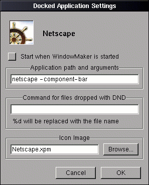
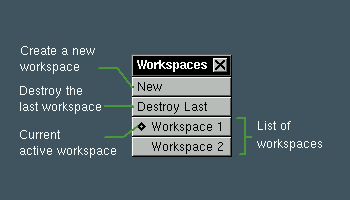
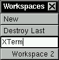

The Workspace
=============

Working with Menus
------------------

Menus provide a list of commands that you can execute.

.. figure:: guide/images/menu.gif
   :figclass: borderless
   :alt: An Example Menu

To execute a command listed in a menu, click in the corresponding item. The
item will blink telling that the command is going to be executed.

Grayed commands are disabled and cannot be executed at that moment. If you
click on them nothing will happen.

Some menu entries have a little triangular indicator at the right. Selecting
these entries will open a submenu, with a new list of commands.

You can use the keyboard to traverse and execute commands in some of the menus.
First you must hit the key used to open the menu - like F12 for the root menu -
to enable keyboard traversal of it. Then you can use the Up and Down arrow keys
to change the current selected item and the Left and Right arrow keys to jump
between submenus and parent menus. To execute the current selected item press
Return. To close the menu or stop menu traversal, press Escape. Additionally,
pressing the first letter for an menu item, will jump the current selection to
that item.

You can make frequently used menus "stick" to the workspace by dragging the
titlebar of the menu. This will make a close button appear in the menu
titlebar. If you want to close the menu, just click in that button.

Menus are normally placed on top of other windows and cannot be obscured by
them. If you want the menus to be able to be obscured by lowering them, double
click the menu titlebar while holding the Meta key. Repeat this to make the
menus not obscurable again.

The Root Window Menu
~~~~~~~~~~~~~~~~~~~~

The *Root Window Menu* or *Applications Menu* has items that allow you to
quickly launch applications and do some workspace management.

To open this menu, click on the workspace (root window) with the 3rd mouse
button or hit the key bound to it (F12 by default).

The contents of the applications menu can be configured to hold the
applications installed on your system. To learn how to configure it, read the
section on application menu configuration.

The Window List Menu
~~~~~~~~~~~~~~~~~~~~

Clicking in the workspace with the middle mouse button will open a menu listing
all windows that currently exist, with the workspace in which the window is
located to its right. The current focused window is marked by a diamond sign
next to its name. Clicking in an entry in this menu will focus the window,
raise it, and change to the workspace where it is located.

Working with Applications
-------------------------

In WindowMaker the instance of a running application is represented by an
application icon. Do not confuse it with the icons (miniwindows in WindowMaker)
displayed by other window managers when a window is iconified. Application
icons and miniwindows can be differentiated in that miniwindows have titlebars,
application icons do not.

WindowMaker identifies a group of windows as belonging to a single instance of
an application through some standard hints that the application sets in its
windows. Unfortunately, not all applications that exist set these hints,
preventing some application-specific features from working. These hints are
**WM.CLASS**, **WM.COMMAND**, and **WM.CLIENT.LEADER** or the group leader in
**WM.HINTS**.

Note: The information about applications contained in this section only applies
to versions of WindowMaker built without the --enable-single-icon compile time
option. This option is unsupported and behaviour when it's enabled will not be
covered in this text.

Hiding an Application
~~~~~~~~~~~~~~~~~~~~~

If you want to close and application but intend to use it later you can *hide*
it. When you hide an application all windows and miniwindows that belong to
that application will be removed from the screen and hidden into its
application icon.

To hide an application:

- Click the miniaturize button of any of the windows that belong to the
  application while holding the Control key.

OR

- Press the keyboard shortcut assigned to it, which is Meta+h in the default
  configuration.

OR

- User the hide command in the `window commands menu
  <chap2.html#the-window-commands-menu>`_ brought up when the window titlebar
  is clicked with the right mouse button.

OR

- Use the (Un)Hide command in the application icon commands menu brought up
  when the application icon is clicked with the right mouse button.

To unhide an application

- Double click the application icon with the left mouse button.

OR

- Use the (Un)Hide command in the application icon commands menu brought up
  when the application icon is clicked with the right mouse button.

When you unhide an application, all it's windows and miniwindows will brought
back, and you will be taken to the last workspace in which you worked with that
application.

**Extra Bindings**

+-----------------------------------+------------------------------------+
| Action                            | Effect                             |
+===================================+====================================+
| Double-click the application icon | Unhide the clicked application,    |
| while holding the Meta key        | and hide all other applications    |
|                                   | that are present in the current    |
|                                   | workspace.                         |
+-----------------------------------+------------------------------------+
| Double-click the application icon | Unhide the clicked application in  |
| while holding the Shift key       | the current workspace              |
+-----------------------------------+------------------------------------+
| Double-click the application icon | Unhide the clicked application and |
| with the middle mouse button      | deminiaturize all its windows.     |
+-----------------------------------+------------------------------------+
| Double-click the window titlebar  | Hide all applications in the       |
| with the right mouse button while | current workspace except for the   |
| holding the Meta key.             | clicked one.                       |
+-----------------------------------+------------------------------------+

There are two other commands in the applications menu related to application
hiding:

Hide others
   Hide all applications in the current workspace, except for the currently
   active one.

Show All
   Unhide all applications that were hidden from the current workspace

The Application Icon Menu
~~~~~~~~~~~~~~~~~~~~~~~~~

A menu with commands that will apply to the application can be brought up by
clicking the application icon with the right mouse button.

The commands available in this menu are:

Unhide Here
   Unhides the application in the current workspace.

(Un)Hide
   Hides the application. Unless the application is already hidden, in which
   case it will unhide the application and take you to its workspace.

Set Icon...
   Opens the icon image selection panel for the application icon.

Kill
   Will kill the application.

The Application Dock
~~~~~~~~~~~~~~~~~~~~

The application dock is a place where you can store frequently used
applications for easy and fast access. It is located, by default, on the right
side of the screen.

You can click the top icon (the one with the GNUstep logo) and drag it downward
to remove most of the dock from view.  You can also drag it sideways to move
the entire dock from side of the screen to the other.

A menu similar to the `application icon menu <#the-application-icon-menu>`_ is
brought up when you click a docked icon with the right mouse button.

To make the dock *float* over windows (not be coverable by windows), either
double-click the top dock icon while holding the Meta key, or select the
"Floating Dock" option in the dock menu.

Starting a docked application
.............................

To start an application that is docked, double-click its icon. The icon will be
briefly highlighted and the application will start.

While an application is not running an ellipsis is present in the lower
left-hand corner of the icon. This ellipsis will disappear when the application
is started and reappear when the application is exited.

While the application is running the docked icon will behave just like a
normal, undocked application icon, except for some extra actions specific to
the dock.

To start a docked application:

- Double-click the application icon with the left mouse button.

OR

- Use the "Launch" command in the dock menu for the icon. If the application is
  already running it will start another instance.

OR

- Hold the Control key while double-clicking the icon to start another instance
  of the application.

If a new instance of an already running application is started it will get a
new application icon.

Customizing the dock
....................

To add new applications to the dock, you can click an application icon and drag
it onto the dock. When a ghost image of the icon appears you can release the
mouse button and the icon will be docked.

To reorder the docked applications, drag an icon to an empty slot and move the
icons around as you want.

To remove a docked application, drag it from the dock and release the mouse
button when the ghost image disappears. To remove the icon of an application
that is running, hold the Meta key while dragging it.

Configuring the docked application
..................................

To change the settings of a docked application, select the "Settings..." item
in the dock menu for that icon. A settings panel for that icon will appear.

In the *Application path and arguments* field, the path for the application and
its arguments can be changed. Note that you can't change the application that
is represented in the icon or change anything that would cause the application
name to be changed. For example, if the icon is for ``xterm`` you can't change
the field's value to **ghostview**; or if the icon is for ``xterm -name vi``,
you can't change it to ``xterm -name pine``. Also note that you cannot use
shell commands, such as output redirectors. (``>``, ``>>``; etc.)

Working with Workspaces
-----------------------

The Workspaces Menu
~~~~~~~~~~~~~~~~~~~~

The *Workspaces Menu* allows you to create, switch, destroy and rename
workspaces.

It has the following items:

New
   Creates a new workspace and automatically switches to it

Destroy Last
   Destroys the last workspace unless it is occupied

Workspaces
   Each workspace has a corresponding item in the Workspaces menu. Clicking in
   one of these entries will switch from the current workspace to the selected
   workspace.

The current active workspace is indicated by a small indicator at the left of
the workspace item.

To change the name of a workspace you must first "stick" the menu. Then Control
click in the item corresponding to the workspace you want to rename. The item
will turn into a editable text field where you can edit the workspace name. To
finish editing the workspace name, press Return; to cancel it, press Escape.

There is a limit of 16 characters on the length of the workspace name.

An example Workspace menu being edited:

The workspace clip
~~~~~~~~~~~~~~~~~~~

.. WTF is that??

[This section was unavailable in the original, and thus is not here]
