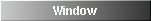

Configuring Window Maker
========================

.. contents::
   :backlinks: none
   :local:

The Defaults System
-------------------

WindowMaker uses a defaults database for storing various information, like
configurations and other data that must be kept between sessions (like the list
of applications of a saved session). The defaults database is stored as
*property lists* in the $(HOME)/GNUstep/Defaults directory. Each file in the
$(HOME)/GNUstep/Defaults directory contains data that belongs to a specific
*domain*.

Any application can use the defaults database to store its information.
Generally an application will have one or more *domains* that belong to it.

Property list File Format
~~~~~~~~~~~~~~~~~~~~~~~~~

The syntax of the property list is simple, but, if you need to change it
manually you must take care not to leave any syntax errors.

The EBNF for the property list is the following:

**Description of the syntax of a property list in the Bacchus Naur Form (BNF)**

.. code::
   :class: highlight

   <object>      ::= <string> | <data> | <array> | <dictionary>
   <string>      ::= text with non-alphanumeric characters | alphanumeric text
   <array>       ::= `(' [ <object> { `,' <object> }* ] `)'
   <dictionary>  ::= `{' [ <keyval_pair> { `,' <keyval_pair> }* ] `}'
   <keyval_pair> ::= <string> `=' <object> `;'

**Example property list file**

.. code::
   :class: highlight

   {
       "*" = {
           Icon = "defaultAppIcon.xpm";
       };
       "xterm.XTerm" = {
           Icon = "xterm.xpm";
       };
       xconsole = {
           Omnipresent = YES;
           NoTitlebar = YES;
           KeepOnTop = NO;
       };
   }

The property list above is a dictionary with 3 dictionaries inside. The first
is keyed by "*", the second by "XTerm.xterm" and the last by "xconsole".

Note that all strings that have non-alphabetic or numeric characters (like a
dot "." or the asterisk "*" are enclosed by double quotes. Strings with only
alphanumeric characters may or may not be enclosed in double quotes, as they
will not make any difference.

Here is another example:

.. code::
   :class: highlight

   {
       FTitleBack = ( hgradient, gray, "#112233" );
   }

The property list in the example above contains an array with 3 elements with a
key named "FTitleBack".

Except for cases like file names and paths, all value strings are case
insensitive, i.e.: YES = Yes = yes = yEs.

Value Types
~~~~~~~~~~~

Here is a description of some of the types of values that an option might have:

+------------------+--------------------------------------------+
| Type             | Value                                      |
+==================+============================================+
| boolean          | YES or NO                                  |
+------------------+--------------------------------------------+
| integer          | any integer number, usually limited        |
|                  | by a range that will be indicated          |
+------------------+--------------------------------------------+
| positive integer | any integer number greater than or         |
|                  | equal to zero (0)                a         |
+------------------+--------------------------------------------+
| speed            | UltraFast, Fast, Medium, Slow, or VerySlow |
+------------------+--------------------------------------------+
| mouse button     | Left, Middle, Right, Button1, Button2,     |
|                  | Button3, Button4, or Button5               |
+------------------+--------------------------------------------+

Preferences
~~~~~~~~~~~

General preference options are stored in the *WindowMaker* domain; i.e. the
$(HOME)/GNUstep/Defaults/WindowMaker file.

Changes in preference options will automatically affect the current WindowMaker
session, without a restart. Some options, however, require a restart of
WindowMaker before they take effect. Such options are marked with a * .

Note that values marked as *Default* are values that are assumed if the option
is not specified, instead of *factory default* values that are set in the
preference file.

.. TODO there is no point for describing all of the options. There is a lot of
   them added, some of the changed and possibly removed. Let's treat them as
   the advanced configuration and point to the right sources, where one can
   easily figure out which options take which values

+----------------------------+---------------------+--------------------------------------+
| Option                     | Value               | Description                          |
+============================+=====================+======================================+
| PixmapPath                 | list of directories | A list of directories where pixmaps  |
|                            | separated  by ":"   | can be found. The pixmaps for things |
|                            | (default: depends   | like icons, are searched in these    |
|                            | on the system)      | paths in order of appearance.        |
+----------------------------+---------------------+--------------------------------------+
| `*NoDithering`             | boolean             | Disable internal dithering of        |
|                            | (default: NO)       | images. Not recommended for displays |
|                            |                     | with less than 8 bits per pixel.     |
+----------------------------+---------------------+--------------------------------------+
| `*ColormapSize`            | integer number > 1  | Number of colors for each of the     |
|                            | (default: 4)        | red, green and blue components to be |
|                            |                     | used for the dithering colormap.     |
|                            |                     | This value must be greater than 1    |
|                            |                     | and smaller than 6 for 8bpp          |
|                            |                     | displays. It only makes sense on     |
|                            |                     | PseudoColor displays. This option    |
|                            |                     | has not effect on TrueColor          |
|                            |                     | displays. Larger values result in    |
|                            |                     | better appearance, but leaves less   |
|                            |                     | colors for other applications.       |
+----------------------------+---------------------+--------------------------------------+
| `*ModifierKey`             | modifier key name   | The key to use as the modifier being |
|                            | (default: Mod1)     | referred as Meta in this manual,     |
|                            |                     | like Meta dragging a window to move  |
|                            |                     | it. Valid values are Alt, Meta,      |
|                            |                     | Super, Hyper, Mod1, Mod2, Mod3,      |
|                            |                     | Mod4, Mod5.                          |
+----------------------------+---------------------+--------------------------------------+
| UseSaveUnders              | boolean             | Use *saveunders* in WindowMaker      |
|                            | (default: NO)       | windows. This can improve            |
|                            |                     | performance but increases memory     |
|                            |                     | usage. It also can cause problems    |
|                            |                     | with refreshing in some              |
|                            |                     | applications.                        |
+----------------------------+---------------------+--------------------------------------+
| DisableClip                | boolean             | Will remove the application Clip     |
|                            | (default: NO)       | from the workspace.                  |
+----------------------------+---------------------+--------------------------------------+
| DisableDock                | boolean             | Will remove the application Dock     |
|                            | (default: NO)       | from the workspace                   |
+----------------------------+---------------------+--------------------------------------+
| Superfluous                | boolean             | Enable extra animations and other    |
|                            | (default: NO)       | cosmetic things that might increase  |
|                            |                     | peak memory and CPU usage.           |
+----------------------------+---------------------+--------------------------------------+
| SaveSessionOnExit          | boolean             | Automatically save the state of the  |
|                            | (default: NO)       | session when exiting WindowMaker.    |
+----------------------------+---------------------+--------------------------------------+
| `*IconSize`                | integer > 4         | The size of application icons and    |
|                            | (default: 64)       | miniwindows.                         |
+----------------------------+---------------------+--------------------------------------+
| OpaqueMove                 | boolean             | Whether the whole window should be   |
|                            | (default: NO)       | moved while dragging it, or, if only |
|                            |                     | it's frame should be dragged.        |
+----------------------------+---------------------+--------------------------------------+
| FocusMode                  | Manual or           | The mode of input focus setting.     |
|                            | ClickToFocus, Auto  | Refer to section `Focusing a Window  |
|                            | or                  | <chap2.html#focusing-a-window>`_     |
|                            | FocusFollowsMouse,  |                                      |
|                            | SemiAuto or Sloppy  |                                      |
|                            | (default:           |                                      |
|                            | ClickToFocus)       |                                      |
|                            |                     |                                      |
+----------------------------+---------------------+--------------------------------------+
| IgnoreFocusClick           | boolean             | Whether the mouse click use to focus |
|                            | (default: NO)       | a window should be ignore or treated |
|                            |                     | normally.                            |
+----------------------------+---------------------+--------------------------------------+
| AutoFocus                  | boolean             | Whether newly created windows should |
|                            | (default: NO)       | receive input focus. Do not confuse  |
|                            |                     | with FocusMode=Auto.                 |
+----------------------------+---------------------+--------------------------------------+
| RaiseDelay                 | integer number      | How many tenths of a second to wait  |
|                            | (default: 0)        | before raising a window in Auto or   |
|                            |                     | Semi-Auto focus mode. 0 disables     |
|                            |                     | this feature.                        |
+----------------------------+---------------------+--------------------------------------+
| DoubleClickTime            | integer number      | If two mouse clicks occur in this    |
|                            | (default: 250)      | interval of time, it will be         |
|                            |                     | considered a double click.           |
+----------------------------+---------------------+--------------------------------------+
| ColorMapMode               | Manual or           | The mode of colormap setting. In     |
|                            | ClickToFocus,       | *Manual* or *ClickToFocus* mode, the |
|                            | Auto or             | colormap is set to the one belonging |
|                            | FocusFollowsMouse   | to the current focused window. In    |
|                            | (default: auto)     | *Auto* or *FocusFollowsMouse* mode,  |
|                            |                     | the colormap is set to the one       |
|                            |                     | belonging to the window under the    |
|                            |                     | pointer.                             |
+----------------------------+---------------------+--------------------------------------+
| CirculateRaise             | boolean             | Whether the window should be raised  |
|                            | (default: NO)       | when circulating. (focus the next or |
|                            |                     | previous window through the          |
|                            |                     | keyboard)                            |
+----------------------------+---------------------+--------------------------------------+
| OnTopTransients            | boolean             | Whether transient windows should     |
|                            | (default: NO)       | always be placed over their owners   |
+----------------------------+---------------------+--------------------------------------+
| WindowPlacement            | auto, cascade,      | Sets placement mode for new windows. |
|                            | manual, or          | *Auto* places the window             |
|                            | random              | automatically in the first open      |
|                            | (default: cascade)  | space found in the workspace.        |
|                            |                     | *Cascade* places the window in       |
|                            |                     | incrementing positions starting from |
|                            |                     | the the top-left corner of the       |
|                            |                     | workspace. *Manual* allows you to    |
|                            |                     | place the window interactively with  |
|                            |                     | the mouse. *Random* paces the window |
|                            |                     | randomly in the workspace.           |
+----------------------------+---------------------+--------------------------------------+
| WindowPlaceOrigin          | (X,Y) where X       | Sets the offset, from the top-left   |
|                            | and Y are integer   | corner of the screen, to place       |
|                            | numbers             | windows. In non-manual               |
|                            | (default: (0,0))    | WindowPlacement modes windows will   |
|                            |                     | not be placed above or to the left   |
|                            |                     | of this point.                       |
+----------------------------+---------------------+--------------------------------------+
| AutoArrangeIcons           | boolean             | Whether icons should be              |
|                            | (default: NO)       | automatically arranged               |
+----------------------------+---------------------+--------------------------------------+
| ResizeDisplay              | center, corner,     | Selects the type or position of the  |
|                            | floating, or        | box that shows the window size when  |
|                            | line                | a window is being resized. *center*  |
|                            | (default: corner)   | places the box in the center of the  |
|                            |                     | workspace, *corner* places it in the |
|                            |                     | top-left corner of the workspace,    |
|                            |                     | *floating* places it in the center   |
|                            |                     | of the window being resized and      |
|                            |                     | *line* draws the current window size |
|                            |                     | over the workspace, like in a        |
|                            |                     | technical drawing.                   |
+----------------------------+---------------------+--------------------------------------+
| MoveDisplay                | center, corner      | Selects the type or position of the  |
|                            | or floating         | box that shows the window position   |
|                            | (default: corner)   | when a window is being moved. The    |
|                            |                     | value meanings are the same as for   |
|                            |                     | the ResizeDisplay option.            |
+----------------------------+---------------------+--------------------------------------+
| AlignSubmenus              | boolean             | Whether submenus should be aligned   |
|                            | (default: NO)       | vertically with their parent menus.  |
+----------------------------+---------------------+--------------------------------------+
| WrapMenus                  | boolean             | Whether submenus should be placed to |
|                            | (default: NO)       | the right of their parent menus when |
|                            |                     | they don't fit the screen. Note that |
|                            |                     | menus placed off the screen can be   |
|                            |                     | scrolled.                            |
+----------------------------+---------------------+--------------------------------------+
| ScrollableMenus            | boolean             | Whether menus that are not fully     |
|                            | (default: NO)       | inside the screen should             |
|                            |                     | automatically scroll when the        |
|                            |                     | pointer is over them and near the    |
|                            |                     | border of the screen.                |
+----------------------------+---------------------+--------------------------------------+
| MenuScrollSpeed            | speed               | The scrolling speed of menus.        |
|                            | (default: medium)   |                                      |
+----------------------------+---------------------+--------------------------------------+
| DontLinkWorkspaces         | boolean             | Do not automatically switch to the   |
|                            | (default: NO)       | next or previous workspace when a    |
|                            |                     | window is dragged to the edge of the |
|                            |                     | screen.                              |
+----------------------------+---------------------+--------------------------------------+
| NoWindowUnderDock          | boolean             | When maximizing windows, limit their |
|                            | (default: NO)       | sizes so that they will not be       |
|                            |                     | covered by the dock.                 |
+----------------------------+---------------------+--------------------------------------+
| NoWindowOverIcons          | boolean             | When maximizing windows, limit their |
|                            | (default: NO)       | sizes so that they will cover        |
|                            |                     | miniwindows and application icons.   |
+----------------------------+---------------------+--------------------------------------+
| StickyIcons                | boolean             | Whether miniwindows should be        |
|                            | (default: NO)       | present in all workspaces.           |
+----------------------------+---------------------+--------------------------------------+
| CycleWorkspaces            | boolean             | Set to YES if you want windows that  |
|                            | (default: NO)       | are dragged past the last workspace  |
|                            |                     | to be moved to the first workspace,  |
|                            |                     | and vice-versa.                      |
+----------------------------+---------------------+--------------------------------------+
| AdvanceToNewWorkspace      | boolean             | Whether windows dragged past the     |
|                            | (default: NO)       | last workspace should create a new   |
|                            |                     | workspace.                           |
+----------------------------+---------------------+--------------------------------------+
| DisableAnimations          | boolean             | Whether animations, like the one     |
|                            | (default: NO)       | done during minimization, should be  |
|                            |                     | disabled.                            |
+----------------------------+---------------------+--------------------------------------+
| IconSlideSpeed             | speed               | The speed of icons when they are     |
|                            | (default: medium)   | being slid across the workspace.     |
+----------------------------+---------------------+--------------------------------------+
| ShadeSpeed                 | speed               | The speed of the shading animation.  |
|                            | (default: medium)   |                                      |
+----------------------------+---------------------+--------------------------------------+
| DisableSound               | boolean             | Whether sound support in WindowMaker |
|                            | (default: NO)       | should be disabled                   |
+----------------------------+---------------------+--------------------------------------+
| `*DisableWSMouseActions`   | boolean             | Whether actions in the workspace     |
|                            | (default: NO)       | triggered by mouse-clicks should be  |
|                            |                     | disabled. This allows the use of     |
|                            |                     | file and desktop managers that place |
|                            |                     | icons on the root window (such as    |
|                            |                     | KDE).                                |
+----------------------------+---------------------+--------------------------------------+
| SelectWindowMouseButton    | mouse button        | The mouse button that activates      |
|                            | (default: left)     | selection of multiple windows in the |
|                            |                     | workspace.                           |
+----------------------------+---------------------+--------------------------------------+
| WindowListMouseButton      | mouse button        | The mouse button that opens the      |
|                            | (default: middle)   | window list menu in the workspace.   |
+----------------------------+---------------------+--------------------------------------+
| ApplicationMenuMouseButton | mouse button        | The mouse button that opens the      |
|                            | (default: right)    | applications menu in the workspace.  |
+----------------------------+---------------------+--------------------------------------+

Appearance Options
~~~~~~~~~~~~~~~~~~

Fonts are specified in the X Logical Font Description format. You can cut and
paste these names from programs like ``xfontsel``.

Colors are specified as color names in the standard X format. This can be any
color name shown by the ``showrgb`` program (like black, white or gray) or a
color value in the #rrggbb format, where rr, gg and bb is the intensity of the
color component (like #ff0000 for pure red or #000080 for medium blue). Note
that color names in the #rrggbb format must be enclosed with double quotes.

Textures are specified as an array, where the first element specifies the
texture type followed by a variable number of arguments.

Valid texture types are:

(solid, color)
   the texture is a simple solid color.

(dgradient, color1, color2)
   the texture is a diagonal gradient rendered from the top-left corner to the
   bottom-right corner. The first argument (color1) is the color for the
   top-left corner and the second (color2) is for the bottom-right corner.

(hgradient, color1, color2)
   the texture is a horizontal gradient rendered from the left edge to the
   right edge. The first argument (color1) is the color for the left edge and
   the second (color2) is for the right edge.

(vgradient, color1, color2)
   the texture is a vertical gradient rendered from the top edge to the bottom
   edge. The first argument (color1) is the color for the top edge and the
   second (color2) is for the bottom edge.

(mdgradient, color1, color2,...,color*n*)
   this is equivalent to drgadient, but you can specify more than two colors

(mhgradient, color1, color2,...,color*n*)
   this is equivalent to hrgadient, but you can specify more than two colors

(mvgradient, color1, color2,...,color<i>n</i>)
   this is equivalent to vrgadient, but you can specify more than two colors

**Examples**:

   (solid, gray)

.. figure:: guide/images/texdgrad.gif
   :figclass: borderless
   :alt: Diagoonal Gradient

   (dgradient, gray80, gray20)

   (hgradient, gray80, gray20)

   (vgradient, gray80, gray20)

+--------------------+----------------------+----------------------------------------+
| Option             | Value                | Description                            |
+====================+======================+========================================+
| `*NewStyle`        | boolean              | Selects between N*XTSTEP style buttons |
|                    | (default: NO)        | in the titlebar and a newer style of   |
|                    |                      | buttons.                               |
+--------------------+----------------------+----------------------------------------+
| WidgetColor        | (solid, color)       | Chooses the color to be used in        |
|                    | where color is a     | titlebar buttons if NewStyle=No;       |
|                    | color name           |                                        |
|                    | (default:            |                                        |
|                    | (solid, grey))       |                                        |
+--------------------+----------------------+----------------------------------------+
| WorkspaceBack      | a texture or         | Default texture for the workspace      |
|                    | none                 | background. Note the *dgradient* and   |
|                    | (default: none)      | *mdgradient* textures can take a lot   |
|                    |                      | of time to be rendered.                |
+--------------------+----------------------+----------------------------------------+
| IconBack           | texture              | Texture for the background of icons    |
|                    | (default:            | and miniwindows.                       |
|                    | (solid, grey))       |                                        |
+--------------------+----------------------+----------------------------------------+
| FTitleBack         | texture              | Texture for the focused window         |
|                    | (default:            | titlebar.                              |
|                    | (solid, black))      |                                        |
+--------------------+----------------------+----------------------------------------+
| PTitleBack         | texture              | Texture for the titlebar of the parent |
|                    | (default:            | window of the currently focused        |
|                    | (solid, "#616161"))  | transient window                       |
+--------------------+----------------------+----------------------------------------+
| UTitleBack         | texture              | Texture for unfocused window           |
|                    | (default:            | titlebars.                             |
|                    | (solid, gray))       |                                        |
+--------------------+----------------------+----------------------------------------+
| MenuTitleBack      | texture              | Texture for menu titlebars.            |
|                    | (default:            |                                        |
|                    | (solid, black))      |                                        |
+--------------------+----------------------+----------------------------------------+
| MenuTextBack       | texture              | Texture for menu items                 |
|                    | (default:            |                                        |
|                    | (solid, gray))       |                                        |
|                    |                      |                                        |
+--------------------+----------------------+----------------------------------------+
| FTitleColor        | color                | The color of the text in the focused   |
|                    | (default: white)     | window titlebar.                       |
+--------------------+----------------------+----------------------------------------+
| PTitleColor        | color                | Color for the text in the titlebar of  |
|                    | (default: white)     | the parent window of the currently     |
|                    |                      | focused transient.                     |
+--------------------+----------------------+----------------------------------------+
| UTitleColor        | color                | The color for the text in the titlebar |
|                    | (default: black)     | of unfocused windows.                  |
+--------------------+----------------------+----------------------------------------+
| MenuTitleColor     | color                | Color for the text in menu titlebars   |
|                    | (default: white)     |                                        |
+--------------------+----------------------+----------------------------------------+
| MenuTextColor      | color                | Color for the text in menu items       |
|                    | (default: black)     |                                        |
+--------------------+----------------------+----------------------------------------+
| HighlightColor     | color                | Color for the highlighted item in      |
|                    | (default: white)     | menus.                                 |
+--------------------+----------------------+----------------------------------------+
| HighlightTextColor | color                | Color for the highlighted item text in |
|                    | (default: black)     | menus.                                 |
+--------------------+----------------------+----------------------------------------+
| MenuDisabledColor  | color                | Color for the text of disabled menu    |
|                    | (default: "#616161") | items.                                 |
+--------------------+----------------------+----------------------------------------+
| ClipTitleColor     | color                | Color for the text in the clip.        |
|                    | (default: black)     |                                        |
+--------------------+----------------------+----------------------------------------+
| CClipTitleColor    | color                | Color for the text in the collapsed    |
|                    | (default: "#454045") | clip.                                  |
+--------------------+----------------------+----------------------------------------+
| WindowTitleFont    | font (default:       | Font for the text in window            |
|                    | Helvetica bold 12)   | titlebars.                             |
+--------------------+----------------------+----------------------------------------+
| MenuTitleFont      | font (default:       | Font for the text in menu titlebars)   |
|                    | Helvetica bold 12)   |                                        |
+--------------------+----------------------+----------------------------------------+
| MenuTextFont       | font (default:       | Font for the text in menu items        |
|                    | Helvetica medium 12) |                                        |
+--------------------+----------------------+----------------------------------------+
| IconTitleFont      | font (default:       | Font for the text in miniwindow        |
|                    | Helvetica medium 8)  | titlebars.                             |
+--------------------+----------------------+----------------------------------------+
| ClipTitleFont      | font (default:       | Font for the text in the clip.         |
|                    | Helvetica bold 10)   |                                        |
+--------------------+----------------------+----------------------------------------+
| Displayfont        | font (default:       | Font for the text information in       |
|                    | Helvetica medium 12) | windows, like the size of windows      |
|                    |                      | during resize.                         |
+--------------------+----------------------+----------------------------------------+
| TitleJustify       | center, left,        | Justification of the text in window    |
|                    | or right             | titlebars.                             |
|                    | (default: center)    |                                        |
+--------------------+----------------------+----------------------------------------+

Keyboard Bindings
~~~~~~~~~~~~~~~~~

Keyboard shortcut specifications are in the form:

.. code::
   :class: highlight

   [<modifier key names> + ] <key name>

Where *modifier key names* specify an optional modifier key, like Meta or
Shift. Any number of modifier keys might be specified. The *key name* is the
actual key that will trigger the action bound to the option.

Examples:

[F10]
   Means the F10 key.

Meta+TAB
   Means the TAB key with the Meta modifier key pressed at the same time.

Meta+Shift+TAB
   Means the TAB key with the Meta and Shift modifier keys pressed at the same
   time.

Key names can be found at /usr/X11R6/include/X11/keysymdef.h The *XK_* prefixes
must be ignored (if key name is *XK_Return* use *Return*).

+-----------------------+---------------+-----------------------------------------+
| Option                | Default Value | Description                             |
+=======================+===============+=========================================+
| RootMenuKey           | None          | Opens the `root window menu             |
|                       |               | <chap3.html#the-root-window-menu>`_     |
|                       |               | at   the current position of the        |
|                       |               | mouse pointer.                          |
+-----------------------+---------------+-----------------------------------------+
| WindowListKey         | None          | Opens the `window list menu`_           |
|                       |               | menu at the current position of the     |
|                       |               | mouse pointer.                          |
+-----------------------+---------------+-----------------------------------------+
| WindowMenuKey         | None          | Opens the `window commands menu         |
|                       |               | <chap2.html#the-window-commands-menu>`_ |
|                       |               | for the currently focused window.       |
+-----------------------+---------------+-----------------------------------------+
| MiniaturizeKey        | None          | Miniaturizes the currently focused      |
|                       |               | window.                                 |
+-----------------------+---------------+-----------------------------------------+
| HideKey               | None          | Hides the currently active              |
|                       |               | application.                            |
+-----------------------+---------------+-----------------------------------------+
| CloseKey              | None          | Closes the current focused window       |
+-----------------------+---------------+-----------------------------------------+
| MaximizeKey           | None          | Maxmizes the currently focused window.  |
+-----------------------+---------------+-----------------------------------------+
| VMaximizeKey          | None          | Vertically Maximizes the currently      |
|                       |               | focused window.                         |
+-----------------------+---------------+-----------------------------------------+
| RaiseKey              | Meta+Up       | Raises the currently focused window.    |
+-----------------------+---------------+-----------------------------------------+
| LowerKey              | Meta+Down     | Lowers the currently focused window.    |
+-----------------------+---------------+-----------------------------------------+
| RaiseLowerKey         | None          | Raises the window under the pointer,    |
|                       |               | or lowers it if it is already raised.   |
+-----------------------+---------------+-----------------------------------------+
| ShadeKey              | None          | Shades the currently focused window.    |
+-----------------------+---------------+-----------------------------------------+
| SelectKey             | None          | Selects current focused window.         |
+-----------------------+---------------+-----------------------------------------+
| FocusNextKey          | None          | Switch focus to next window.            |
+-----------------------+---------------+-----------------------------------------+
| FocusPrevKey          | None          | Switch focus to previous window.        |
+-----------------------+---------------+-----------------------------------------+
| NextWorkspaceKey      | None          | Switches to next workspace.             |
+-----------------------+---------------+-----------------------------------------+
| PrevWorkspaceKey      | None          | Switches to previous workspace.         |
+-----------------------+---------------+-----------------------------------------+
| NextWorkspaceLayerKey | None          | Switches to the next group of 10        |
|                       |               | workspaces.                             |
+-----------------------+---------------+-----------------------------------------+
| PrevWorkspaceLayerKey | None          | Switches to the previous group of       |
|                       |               | 10 workspaces.                          |
+-----------------------+---------------+-----------------------------------------+
| Workspace1Key         | None          | Switches to workspace 1.                |
+-----------------------+---------------+-----------------------------------------+
| Workspace2Key         | None          | Switches to workspace 2, creating       |
|                       |               | it if it does not exist.                |
+-----------------------+---------------+-----------------------------------------+
| Workspace3Key         | None          | Switches to workspace 3, creating       |
|                       |               | it if it does not exist.                |
+-----------------------+---------------+-----------------------------------------+
| Workspace4Key         | None          | Switches to workspace 4, creating       |
|                       |               | it if it does not exist.                |
+-----------------------+---------------+-----------------------------------------+
| Workspace5Key         | None          | Switches to workspace 5, creating       |
|                       |               | it if it does not exist.                |
+-----------------------+---------------+-----------------------------------------+
| Workspace6Key         | None          | Switches to workspace 6, creating       |
|                       |               | it if it does not exist.                |
+-----------------------+---------------+-----------------------------------------+
| Workspace7Key         | None          | Switches to workspace 7, creating       |
|                       |               | it if it does not exist.                |
+-----------------------+---------------+-----------------------------------------+
| Workspace8Key         | None          | Switches to workspace 8, creating       |
|                       |               | it if it does not exist.                |
+-----------------------+---------------+-----------------------------------------+
| Workspace9Key         | None          | Switches to workspace 9, creating       |
|                       |               | it if it does not exist.                |
+-----------------------+---------------+-----------------------------------------+
|                       |               |                                         |
| Workspace10Key        | None          | Switches to workspace 10, creating      |
|                       |               | it if it does not exist.                |
+-----------------------+---------------+-----------------------------------------+
| ClipLowerKey          | None          | Lowers the clip.                        |
+-----------------------+---------------+-----------------------------------------+
| ClipRaiseLowerKEy     | None          | Raises the clip, or lowers it if        |
|                       |               | it is already raised.                   |
+-----------------------+---------------+-----------------------------------------+

Window Attributes
~~~~~~~~~~~~~~~~~

Window attributes are stored in the $(HOME)/GNUstep/Defaults/WMWindowAttributes
file.

The contents of this file is a dictionary of attribute dictionaries keyed by
window names. Like this:

.. code::
   :class: highlight

   {
           "*" = {
                   Icon = "defaultAppIcon.xpm";
           };
           "xterm.XTerm" = {
                   Icon = "xterm.xpm";
           };
           xconsole = {
                   Omnipresent = YES;
                   NoTitlebar = YES;
                   KeepOnTop = NO;
           };
   }

Window names are in the form [1]_ :

- <window instance name>.<window class name>

OR

- <window instance name>

OR

- <window class name>

Placing an asterisk as the window name means that the values set for that key
are to be used as default values for all windows. So, since xconsole does not
specify an Icon attribute, it will use the default value, which in the above
example is defaultAppIcon.xpm.

**Options:**

The default is NO for all options

+---------------------+------------------+-------------------------------------+
| Option              | Value            | Description                         |
+=====================+==================+=====================================+
| Icon                | pixmap file name | Assigns a pixmap image to be        |
|                     |                  | used as the icon for that window.   |
+---------------------+------------------+-------------------------------------+
| NoTitleBar          | boolean          | Disables the titlebar in the        |
|                     |                  | window.                             |
+---------------------+------------------+-------------------------------------+
| NoResizeBar         | boolean          | Disables the resizebar in the       |
|                     |                  | window.                             |
+---------------------+------------------+-------------------------------------+
| NoMiniaturizeButton | boolean          | Remove the miniaturize              |
|                     |                  | button.                             |
+---------------------+------------------+-------------------------------------+
| NoCloseButton       | boolean          | Remove the close button.            |
+---------------------+------------------+-------------------------------------+
| NoHideOthers        | boolean          | Do not hide the window, or the      |
|                     |                  | application to which the window     |
|                     |                  | belongs when a *Hide Others*        |
|                     |                  | command is issued.                  |
+---------------------+------------------+-------------------------------------+
| NoMouseBindings     | boolean          | Do not grab mouse buttons in that   |
|                     |                  | window. This means that actions     |
|                     |                  | like a Meta-click on the window     |
|                     |                  | will be caught by the application   |
|                     |                  | instead of WindowMaker.             |
+---------------------+------------------+-------------------------------------+
| NoKeyBindings       | boolean          | Do not grab keys in that window.    |
|                     |                  | This means that keystrokes that     |
|                     |                  | would normally be intercepted by    |
|                     |                  | WindowMaker (because they are       |
|                     |                  | bound to some action), like         |
|                     |                  | Meta+Up, will be passed to the      |
|                     |                  | application.                        |
+---------------------+------------------+-------------------------------------+
| NoAppIcon           | boolean          | Do not create application icon for  |
|                     |                  | the window. This is useful for some |
|                     |                  | applications that incorrectly get   |
|                     |                  | more than one application icon.     |
+---------------------+------------------+-------------------------------------+
| KeepOnTop           | boolean          | Always keep the window over other   |
|                     |                  | normal windows.                     |
+---------------------+------------------+-------------------------------------+
| Omnipresent         | boolean          | Make the window be present in all   |
|                     |                  | workspaces, AKA sticky window.      |
+---------------------+------------------+-------------------------------------+
|                     |                  |                                     |
| SkipWindowList      | boolean          | Do not list the window in the       |
|                     |                  | `window list menu`_                 |
+---------------------+------------------+-------------------------------------+
|                     |                  |                                     |
| KeepInsideScreen    | boolean          | Always keep the window inside the   |
|                     |                  | visible are of the screen.          |
+---------------------+------------------+-------------------------------------+
| Unfocusable         | boolean          | Do not let the window be focused.   |
+---------------------+------------------+-------------------------------------+
| StartWorkspace      | Workspace number | Make the window always be initially |
|                     | or name          | shown in the indicated workspace.   |
+---------------------+------------------+-------------------------------------+

Applications Menu
~~~~~~~~~~~~~~~~~

The applications menu (AKA: Root Menu) can be defined in one of two distinct
ways:

- In the form of an array in property list format, in
  $(HOME)/GNUstep/Defaults/WMRootMenu
- In the form of a text file, whose location is present in
  $(HOME)/GNUstep/Defaults/WMRootMenu

----

.. [1] You can get the values for these information by running the ``xprop``
   utility on the desired window. When you do that, it will show the following
   line, among other things:

   .. code::
      :class: highlight

      WM_CLASS(STRING) = "xterm", "XTerm"

   The first string (xterm) is the window instance name and the second (XTerm)
   the window class name.

.. _window list menu: chap3.html#3.12
