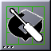
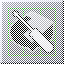
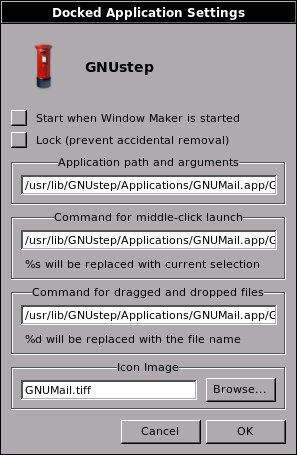

Dock
====

.. contents::
   :backlinks: none

Application dock
----------------

The dock is the column of icons located by default on the right side of the
screen.

Any application can be attached to the dock. To do this, open an application
then simply left-click-and-drag the application's icon to the last position on
the dock. The dock will "attract" the icon and it will remain on the dock until
removed by the user (left-click-and-drag the icon off the dock - it will
disappear.) If you have saved your Window Maker session prior to logout (or set
Window Maker to autosave your session upon logout) any icons you docked will
automatically reappear at your next - and each subsequent - session.

The dock can be configured to remain on top of maximized windows. To do this,
right-click on a dock or any docked icon then select appropriate option form
*Dock position* submenu. Consult `Application icon menu
<menu.html#application-icon-menu>`_ for details.

The WMDock icon (by default, with the GNUstep logo) can be dragged sideways to
switch the the entire dock from one side of the display to the other.

Dragging the WMDock icon downward will move the dock off the display with the
exception of the WMDock icon itself, which will remain visible. To restore dock
visibility, left-click-and-drag the dock back on screen.

Starting an application
-----------------------

Double-clicking the icon of a docked application starts the application.

An application that has not been launched normally has an elipsis (three dots)
in the bottom-left-corner of the icon and appears in full color as shown below.

   Unlaunched application icon

When the application is running, the elipsis disappears from the
bottom-left-corner of the icon and the icon becomes highlited.

.. figure:: images/launched_app.png
   :alt: Launched application icon
   :figclass: borderless

   Launched application icon

Sometimes, when the application is running, instead of highlited icon, the icon
becomes "greyed out", giving a visual cue that the application is already open,
and cannot be launched again.

   Grayed-out application icon

A docked icon that continues to show an elipsis and remains "full color" even
after an instance of the application is running indicates that the
application's settings have been modified to allow multiple launches from one
docked icon. To do this you must open the application and modify the
"application specific" settings in the `commands menu <win.html#menu>`_ of the
application to allow "shared application icons".

Using the "launch" command in the "application icon menu" for the icon is
another way to start an application from the dock.

From version 0.80.0 on, the dock can "steal" appicons. This feature has nothing
to do with Autoattract Icons. When you start an application from somewhere else
than either the clip or the dock (menu or terminal), and the appicon exists in
one of them (clip or dock), this appicon doesn't appear at the bottom of your
screen. The appicon existing in the clip or the dock "stole" it. As a result,
the appicon is the same as the one used to start the application from the clip
or the dock.

Customizing
-----------

Left-clicking and dragging an application icon to the dock adds this
application to the dock. Obviously, this means the application is running!

*Miniwindows* (windows of minimized applications) cannot be docked. The small
titlebar on the miniwindow differentiates it from an application's icon.

Dragging an icon off the dock removes the docked application.

Configuring
-----------

There is a dock menu for each icon. Right-clicking the icon displays the
"application icon menu". Select the "Settings..." option to configure the
application.

   Launched application icon

The application's *path* and its arguments, the command for middle-click
launch, and the icon employed can be changed in this panel.

Shell commands such as redirection cannot be used in the command field.

The desired icon must be in one of the directories displayed in the panel while
browsing. New directories can be added from the `Search path preferences
<prefs.html#search-path>`_.

A checkbox allows you to start the application when Window Maker is first
started. (Note: *You want to be careful with this*. If you have, for example,
your terminal emulator, your file manager, and your browser set to start when
Window Maker is started you'll get an open terminal, an open file manager and
an open browser *every time* you start a session! Normally you will only want
to start certain dockapps - "regular" applications like a terminal emulator or
browser can be started *after* your session is up and going.)

From version 0.62.0 on, a checkbox can be used to prevent accidental
removal from the dock.

From version 0.70.0 on, a new field has been added for middle-click launch.
Entering, for example, "firefox" into a docked application settings panel will
launch the Firefox browser.
