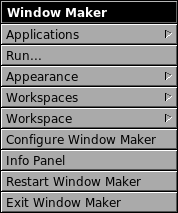
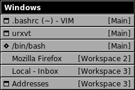
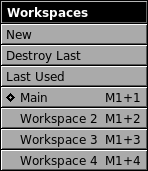
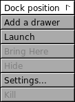

Menus
=====

.. contents::
   :depth: 1
   :backlinks: none
   :local:

Menu list
---------

Different menus are available within Window Maker:

- The root window menu or applications menu
- The window list menu
- The workspace menu
- The application icon menu

Menus provide a list of applications or commands for execution. They can be
used to launch applications, to get information, to configure the workspace...

Menus are opened by right-clicking either in the "blank" area of the workspace
or in a window's titlebar or in docked icons. The *window list menu* is the
only one opened with the middle mouse button.  With a two-button mouse,
pressing both buttons at once usually does the trick. A number of keyboard
shortcuts are provided. These shortcuts are indicated by the modifier key +
letter shown to the right of a menu item.

The keyboard can be used to open and move through some of the menus.  For
instance, the root menu can be opened using F12 (default setting).  The Up and
Down arrow keys can then be used to navigate through the menu or the Left and
Right arrow keys to jump between parent menus and submenus. Hitting the *Enter*
key executes the selected item. The *Escape* key closes the menu or stops menu
traversal.

Menus can be forced to remain open on the workspace by left-clicking the
titlebar. This creates a *close* button on the titlebar.

Root window menu
----------------

   Root window menu (applications menu)

The root window menu or applications menu is opened by right-clicking on an
empty area of the workspace or by hitting the pre-defined keyboard shortcut
(default is F12). This menu launches applications, allows for the customization
of the workspace (backgrounds, themes...), and the management of other
workspace characteristics using standard X utilities (xprop, xfontsel,
xcmap...).

The menu content is totally configurable, either using WPrefs.app or by editing
the plain text menu file. Instructions on how to configure one or the other can
be found in the WindowMaker directory of the distribution. To use WPrefs.app,
menus must be in property list format (plmenu). A script is available to
convert plain text menus to property list menus and it's called wm-oldmenu2new.

Window list menu
----------------

   Window list menu

Middle-clicking an empty area of the workspace opens the window list menu. With
a two-button mouse, clicking both buttons at once usually gives the same
result. F11 is the default keyboard shortcut to open the window list menu.

This menu lists all windows - whether active or inactive - in every workspace.
The workspace containing each window is indicated at the right of the window
name. The current focused window is marked by a diamond sign to the left of the
window's name. Clicking any window in the list focuses and raises the
corresponding window and moves you to the workspace where it's located.

Workspaces menu
---------------

   Workspaces menu

The workspaces menu is part of the root menu (applications menu). This item
has three options: *new*, *destroy last* and *last used*.

The first option creates a new workspace and automatically switches you to it.

The second option destroys the last workspace as soon as there are no windows
opened in it.

The third option switches to last visited workspace.

Each workspace has a corresponding item in this menu. The active workspace is
indicated by a diamond to the left of the workspace name or number.

Clicking a workspace entry switches from the current workspace to the selected
workspace.

To change the name of a workspace, first "stick" the menu by left-clicking the
menu titlebar. Then *Ctrl + click* the menu item to make it editable and type
in the new name. Hitting *Return* saves the new name, hitting *Escape* cancels
the operation.

Key bindings allow movement from one workspace to another. Usually *Meta +
(number)*. The *Meta* key is normally the "*Alt*" key, while *(number)*
represents a number key that corresponds to the workspace number. For instance
1 can be the default workspace (workspace 1), 2 the second workspace and so on.
Thus, *Meta + 2* switches to workspace 2.

These key bindings can be set (or changed) from the keyboard shortcut dialog in
WPrefs.app.

Application icon menu
---------------------

   Icon application menu

Clicking an icon in the dock with the right mouse button brings a menu for
modifying that icon's application. There are several options available in the
application icon menu for docked applications. Docked, but not running
applications will not have all options available - they will appear "greyed
out" in the menu.

#. First option is a global Dock submenu, which have three items:

   #. *Normal* will not change dock behaviour - it can be covered by windows,
      while clicking on any docked items will bring it up.

   #. *Auto raise & lower* is similar for the first options, although you don't
      have to click on dock - it's enough to hover mouse pointer on visible
      part of dock or it's items.

   #. *Keep on top* means that the dock will always be on "top" of opened
      windows.

#. *Add a drawer* will add special dockapp which can be used for aggregating
   applications. See `Dock <dock.html>`_ for more details about drawers.

#. "Launch" opens the application without double-clicking the icon.

#. "Bring here" unhides the application in the current workspace.

#. "Hide" hides the application or unhides it if already hidden. Unhiding opens
   the application in the workspace where it is located. (This option may not
   work if the application has it's own hiding menu option.)

#. "Settings" allows the modification of application path and arguments, the
   command line, and the icon used.

#. "Kill" closes the application immediately and should only be used if
   absolutely necessary.
