===========
Preferences
===========

.. figure:: images/wprefs.jpg
   :height: 64
   :width: 64

WPrefs.app
----------

WPrefs.app is the heart of the configuration process in Window Maker.

Upon installing Window Maker and running it for the first time, the WPrefs icon
is already docked. By default, it's the one with the GNUstep logo in the
background and a few tools in the foreground (although your distibution may use
the plain GNUstep icon or something enitrely different). Normally Linux
distributions position WPrefs as the second or third icon in the Dock column by
default, just above or below the terminal icon.

   ..

.. figure:: images/gnustep_64.png
   :alt: GNUstep Logo
   :height: 64
   :width: 64

   ..

Double-clicking on this icon opens the WPrefs.app window. Across the top of
the window there is a row of icons, each one corresponding to a group of
settings options. There is a checkbox for balloon help on the bottom left of
the WPrefs.app window. Most of the following is taken directly from the content
of the ballon help dialogs.

.. contents:: Available preference settings
   :backlinks: none
   :local:

Window focus
~~~~~~~~~~~~

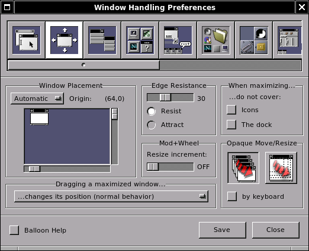

The first icon from the left-hand side controls the way windows get
their focus (how they are activated).

- *Input focus mode* (two choices are available):

  - **Manual** - click on the window to set keyboard input focus.
  - **Auto** - set keyboard input focus to the window under the mouse pointer.

- *Install colormap in the window*

  Select either (a) install the colormap in the window that has the input focus
  or (b) that is under the mouse pointer.

- *Automatic window raise delay*

  Setting the delay (in msec) for automatic window raising

- *Checkboxes*

  The topmost check box prevents applications from receiving the focusing
  mouse-click (I don't know why you would use this, but some people obviously
  find it useful). The bottom checkbox allows you to choose whether
  newly-opened application windows automatically receive the focus, or must be
  clicked to gain focus.

Window handling
~~~~~~~~~~~~~~~

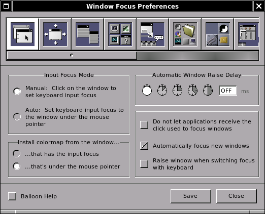

Clicking the second icon allows you to select the window handling options.
Clicking on this icon opens a panel allowing you to define the default
placement and properties of windows in the workspace.

- *Window placement*

  You can use the sliders around the screen representation to modify the
  original placement. The gadget tells Window Maker how to order windows on the
  screen: *Random*, *Manual*, *Cascade* or *Smart*. *Automatic* is the default.

- *Edge resistance*

  To set the edge resistance and whether it resists or attracts windows.
  According to the selection, windows resist or attract when moved against
  other windows or the edges of the screen. The slider defines the threshold.
  Some applications' title bars may disappear at the top of the screen, with
  the window being too high for the screen area. Setting the edge resistance to
  "0" may solve this problem.

- *Open dialogs in the same workspace as their owners*

  Obviously, whether to force dialog boxes "spawned" by an application to open
  in same workspace as their owners.

- *Opaque move/resize*

  Clicking on *opaque move* causes windows to be moved with their contents
  visible. If not checked, only the frame is displayed during the move. *Opaque
  resize* makes window contents visible during resizing, otherwise only the
  frame is displayed.

- *When maximizing*

  This option allows the window to cover (or not) icons or the dock when
  maximizing.

Menu
~~~~

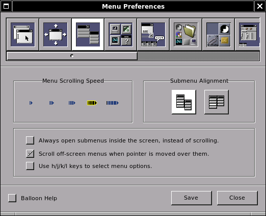

This panel allows you to set menu scrolling speed and submenu alignment with
the parent menu. In addition, two checkboxes are provided:

- The topmost box forces submenus to open inside the screen instead of
  scrolling when they would otherwise be off-screen.
- The middle box allows submenus to open off-screen, but causes off-screen
  menus to scroll when the mouse pointer is moved over them. This setting is
  also of value if you "tear off" a menu and leave it positioned on the
  desktop. In that case, you might wish to "park" the menu off-screen (with
  only the titlebar showing, for example) and have it reappear when you mouse
  over it. This is convenient in some workflows, as when you have multiple
  applications open and you are using the window list menu to switch between
  applications.
- The bottom box allows you to assign EMACS-like keybindings for the selection
  of menu items.

Icon
~~~~

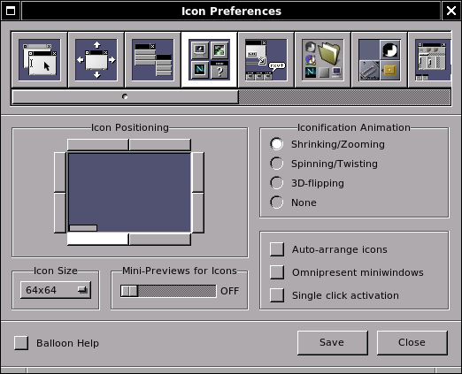

Set icon or miniwindow handling options.

- *Icon positioning*

  This area defines the initial placement of miniwindows or icons will be
  displayed: *bottom, top, right, left*...

- *Checkboxes*

  The topmost box enables/disables auto-arrangement of icons. The bottom box
  places miniwindows for opened applications on all existing workspaces
  (*omnipresent*).

- *Iconification animation*

  When an application's window is miniaturized, *miniaturization animation
  style* offers four animation choices.

  - Shrinking/Zooming,
  - Spinning/Twisting,
  - 3D Flipping, or
  - None

- *Icon size*

  Selects the size of the icons shown when a window is miniaturized and for
  application icons. Dockapp developers usually assume that tiles will be 64x64
  pixels, so it's probably a good idea to leave it at that size, unless you
  know you won't be using dockapps.

Ergonomy
~~~~~~~~

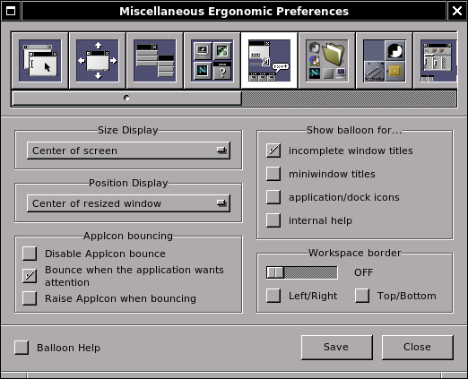

Various types of information are defined in this panel.

- *Size display*

  Window Maker provides a box that informs you about the size of a window
  during resizing. You may choose to have this display (a) in the center of the
  screen, (b) the center of the screen, (c) the center of the resized
  window, (d) the side and bottom of the window as a technical drawing-like
  size display or (e) not at all.

- *Position display*

  Same information as above but regarding the screen placement of a
  window while moving (no technical drawing-like option).

- *Workspace border*

  You can set a small border for the workspace. This allows you to easily
  access the clip (for instance) when windows are maximized.

- *Show balloon text for*

  Selecting checkboxes displays balloon text for: incomplete window titles,
  miniwindow titles, application and dock icons, or internal help. This may be
  useful for new users but many people find having help balloons pop out all
  over the desktop gets annoying quickly. I use the *incomplete window title*
  and the *miniwindow title* options and none of the others.

- *Checkbox*

  The top check bos, if selected, raises a window when switching focus with the
  keyboard. The bottom box enables a keyboard language selection button on
  window titlebars (must have multiple keyboard maps/locales defined - this is
  handy if you are working in multiple languages in applications such as word
  processors, for example).

Search Path
~~~~~~~~~~~

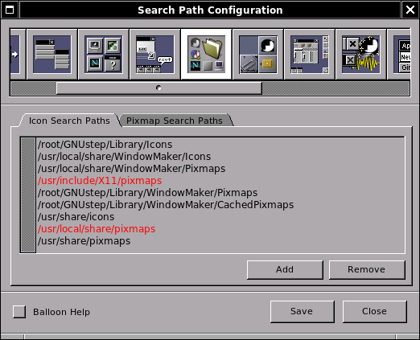

This panel is used to add or delete directory paths to search for icons and
pixmaps. These paths are used in the *settings* dialogs for dockapps and docked
application icons, so having a good, complete set of defined paths is
important. This may require some manual intervention, especially upon initial
setup, since some default paths will not be present on your system, while
others not predefined will be present. Use the *add* and *remove* dialogs to
configure according to what is actually available.

Workspace
~~~~~~~~~

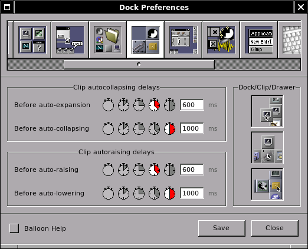

This panel defines navigation features within the workspace.

- *Workspace navigation*

  Selecting the first checkbox allows switching to the first workspace when
  switching past the last workspace and vice-versa. Selecting the second
  checkbox allows windows to be dragged from one workspace to another.
  Selecting the third checkbox cause a new workspace to be created when windows
  are dragged off the last existing workspace. A selection menu allows you to
  define where the workspace name is displayed each time you move from one
  workspace to another (or not to display the workspace name at all).

- *Dock and clip*

  Enables / disables the dock and/or the clip. I have seen some interesting
  configurations using no dock but having the clip present. For users who
  prefer a bottom or top "panel" of application launchers, system monitors and
  other tools, this is a very valuable bit of flexibility.

Other
~~~~~

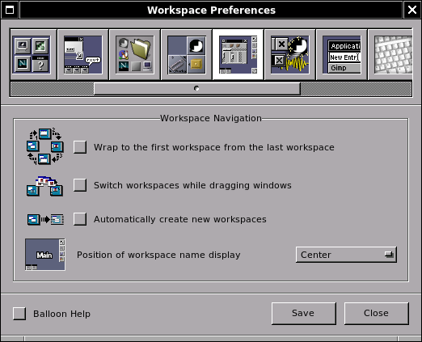

This panel sets icon slide speed, shade animation speed, smooth scaling and
titlebar control (button) style. Animations and sound are also defined here.

- *Icon slide speed*

  Selecting the left icon gives the slowest result, selecting the right one
  gives the fastest.

- *Shade animation speed*

  Same as icon slide

- *Smooth scaling*

  If selected, neutralizes pixelization effect on background images. The
  side-effect is to slow down background image loading.

- *Titlebar style*

  To choose a more or less "NeXTish" titlebar. (The top version is "newer,"
  while the bottom left is ca. 1990 and the bottom right is ca. 1988.)

- *Animations*

  Selecting the animations icon enables animations for window miniaturization,
  shading and so on. Selecting the superfluous icon enables "ghosting" of dock
  (when moved - especially when moved from one side of the screen to the other)
  and explosion animation for icons you remove from the dock.

- *Dithering colormap for 8bpp*

  For 8-bit displays (anyone still have one of these?) this enables dithering
  and changes the number of colors to reserve either for applications or for
  Window Maker. The Default setting almost always gives the best result.

Applications menu
~~~~~~~~~~~~~~~~~

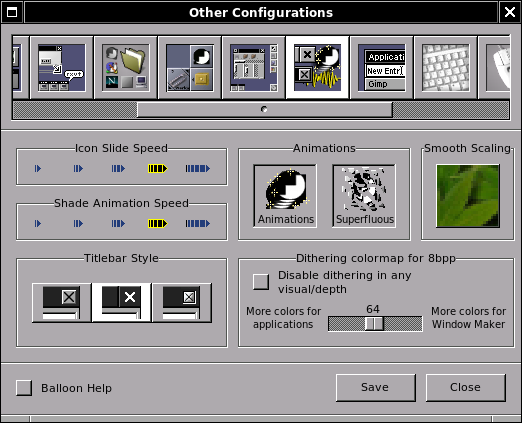

In this panel the applications menu and the commands to launch each application
can be defined. This panel has been changed in version 0.63.and later. It now
displays the actual menu thus allowing direct editing. This can be done only if
the menu is in property list format.  Menus in plain text format can't be
edited in WPrefs. Check the README file in the Window Maker directory on how to
use one or the other.

Keyboard shortcut
~~~~~~~~~~~~~~~~~

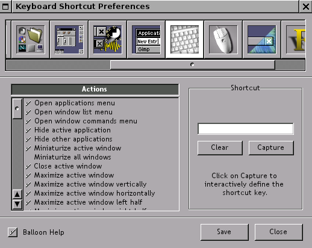

Many actions in Window Maker have predefined keyboard shortcuts. These actions
mainly concern windows and workspaces. Modifying, adding or removing shortcuts
can be done in this panel. Defining a shortcut can be done interactively,
capturing the key combination.

Mouse
~~~~~

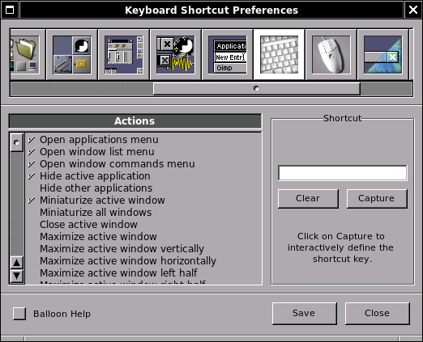

This panel sets the mouse speed and double-click delay. Mouse button bindings
can be defined and can be disabled or enabled.

The default setting binds the right mouse button to the applications menu,
middle button to the window list menu and left button to window selection
(focus). Of course, with a two button mouse, the middle button binding will not
work. However, on some OSes pressing both buttons at once gives the same result
as the one obtained with middle button.

Starting from version 0.65 on, the mouse wheel can be used to switch
workspaces. This is not default behavior and must be enabled here.

The mouse grab modifier represents the keyboard shortcut to use for actions
like dragging windows with the mouse or clicking inside the window. Mod1 (Alt)
is the default.

Appearance
~~~~~~~~~~

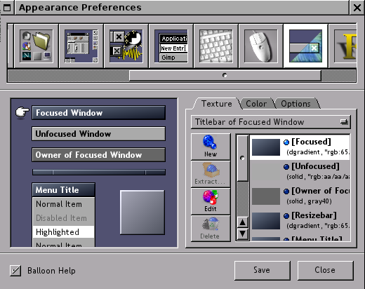

In this panel, everything related to the appearance of the GUI (except the
background color or image) can be configured. Windows, menus and icons can have
their own background "texture," meaning color gradients of various types can be
configured here. Texture, color, menu style, and title alignment can be fully
customized.

Font configuration
~~~~~~~~~~~~~~~~~~

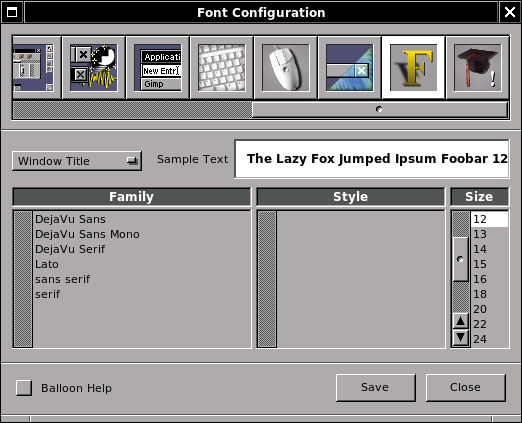

This panel allows you to configure fonts for the window and menu titlebars, for
the menu body text, and for the icon and clip text. In addition, a font may be
defined for desktop messages.

Expert user
~~~~~~~~~~~

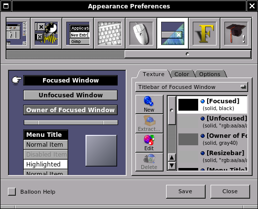

Using this panel implies some knowledge. Many options are available. Among
these are:

- Disabling miniwindows (useful when using with KDE and GNOME)
- Using (or not) xset
- Saving session on exit (highly recommended!)
- Using SaveUnder in different objects
- Using Win style cycling (added from version 0.63.0)
- Disabling confirmation panel for the kill command
- Disabling cycling colors highlighting of icons

Editing the configuration file
~~~~~~~~~~~~~~~~~~~~~~~~~~~~~~

If needed, the defaults configuration file found in
$(HOME)/GNUstep/Defaults/WindowMaker can be edited by hand. This file is a
database with a property list syntax. When selecting an option in WPrefs.app,
it's written down into this file. When modifying this defaults file, it's very
important to follow the syntax.
