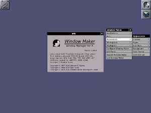

Introduction
============

**Window Maker** is an X11 [window
manager](http://en.wikipedia.org/wiki/Window_manager) originally designed to
provide integration support for the [GNUstep](http://gnustep.org) Desktop
Environment, although it can run stand alone. In every way possible, it
reproduces the elegant look and feel of the
[NeXTSTEP](http://en.wikipedia.org/wiki/NeXTSTEP) user interface.

{:.screenshot .center}

Window Maker on first run
{:.caption .center}

The key features of Window Maker are:

- Stacking window manager with ability for semi-automatic tiling management
- Lightweight and blazing fast
- Easy to use
- Highly configurable
- Ability to bind keyboard shortcut to wide set of actions
- Dynamic menu entries 
- Small, dockable apps ([dockapps](https://www.dockapps.net))
- Human readable config files and GUI prefs application
- Free and open source
- Active community from all of the world

See [features](features.html) section for more.

Download
--------

Many distributions already have Window Maker included in their software
repositories, so it could be installed directly from there. Other sources are
listed below:

- Latest source of stable version is 
  [0.95.8](pub/source/release/WindowMaker-0.95.8.tar.gz), released on
  11.03.2017. See the [NEWS](news) section for more information.
- Source code is also available through the
  [git repository](http://repo.or.cz/w/wmaker-crm.git)
