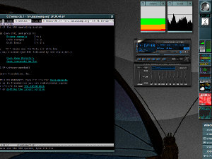
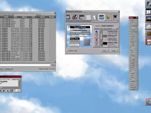
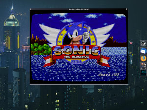
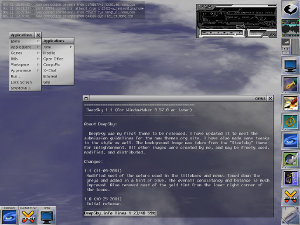
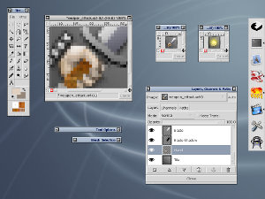
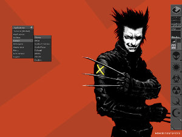
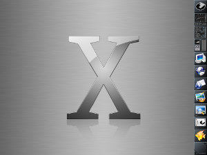
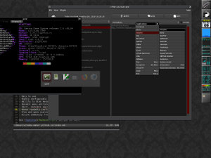
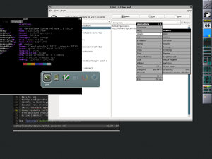

Screenshots
===========

To get an impression how Window Maker could look like, here are couple of
screenshots.

{:.gallery}

{:.gallery}

{:.gallery}

{:.gallery}

{:.gallery}

{:.gallery}

{:.gallery}

{:.gallery}

{:.gallery}

{:.gallery}

